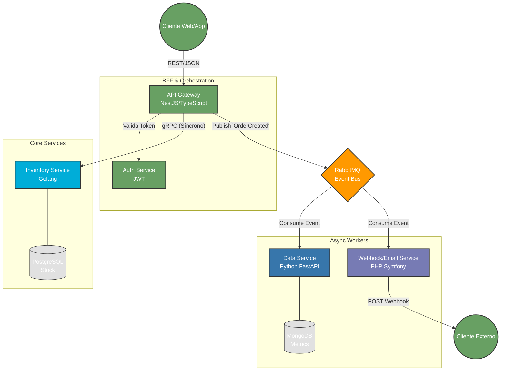

# PolyglotMicro: Sistema de E-Commerce Distribuido y Escalable

  

## 📖 Visión General
**PolyglotMicro** es una arquitectura de referencia para sistemas de comercio electrónico de alto rendimiento. Este proyecto demuestra la implementación de un ecosistema de **microservicios políglota**, orquestando las fortalezas de **Go, Python y Node.js** para resolver problemas específicos de dominio.

El objetivo no es solo procesar órdenes, sino demostrar patrones de **resiliencia, consistencia eventual y comunicación asíncrona**.

### 🚀 Stack Tecnológico y Decisiones de Arquitectura

| Servicio | Tecnología | Rol | ¿Por qué esta elección? |
| :--- | :--- | :--- | :--- |
| **API Gateway** | **Node.js (NestJS) + TypeScript** | Puerta de Enlace | Manejo eficiente de I/O no bloqueante y tipado estricto para orquestar peticiones al cliente. |
| **Inventory Core** | **Go (Golang) + gRPC** | Gestión de Stock | **Alta concurrencia**. Go maneja miles de transacciones de bloqueo de inventario con latencia mínima. |
| **Data & Analytics** | **Python (FastAPI)** | Análisis de Ventas | Aprovecha el ecosistema de Data Science (Pandas) para procesar métricas en tiempo real. |
| **Notifications** | **PHP (Symfony)** | Webhooks & Emails | Estabilidad y robustez para integraciones de terceros y despacho de correos. |
| **Infraestructura** | **RabbitMQ & Redis** | Broker & Caché | Desacoplamiento de servicios mediante eventos (Event-Driven Architecture). |

---

## 🏗 Arquitectura

El sistema utiliza un patrón **API Gateway** con comunicación híbrida:
* **Síncrona (gRPC):** Para operaciones críticas donde la latencia es vital (ej. verificar stock antes de pagar).
* **Asíncrona (RabbitMQ):** Para operaciones secundarias (ej. enviar email de confirmación, actualizar dashboard de analítica).

*(Ver diagrama de arquitectura más abajo)*

PolyglotMicro/
├── api-gateway/       # Node.js (NestJS)
├── inventory-service/ # Go (Golang)
├── analytics-service/ # Python (FastAPI)
├── notification-svc/  # PHP (Symfony)
├── protos/            # Definiciones gRPC (.proto) compartidas
└── docker-compose.yml # Orquestación

## 🛠 Instalación y Despliegue

La infraestructura está totalmente contenerizada. No necesitas instalar Go o Python localmente.

### Prerrequisitos
* Docker & Docker Compose

### Pasos
1. Clonar el repositorio:
    git clone [https://github.com/systaxiecuador/polyglot-micro.git](https://github.com/systaxiecuador/polyglot-micro.git)
    cd polyglot-micro
2. Configurar variables de entorno
    cp .env.example .env
2. Levantar el ecosistema:
    docker-compose up --build -d
3. Acceder a la documentacion de la API:
    http://localhost:3000/api/docs

Autor: Oscar Ordoñez
Desarrollado como parte de mi portafolio profesional backend.

LinkedIn: https://www.linkedin.com/in/oscarordonez0102/

Email: systaxiecuador@gmail.com