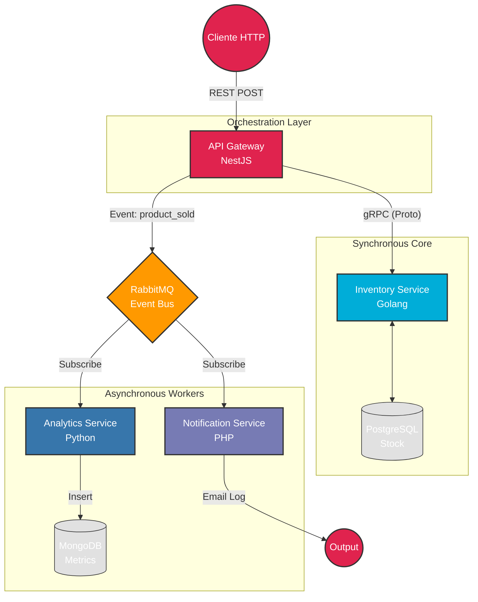

# PolyglotMicro: Ecosistema de Microservicios Políglota

  

## 📖 Visión General

**PolyglotMicro** es una arquitectura de referencia diseñada para demostrar la implementación de un sistema de comercio electrónico distribuido, escalable y resiliente. 

Este proyecto orquesta un ecosistema **políglota** aprovechando las fortalezas nativas de cada lenguaje:
* **Node.js** para I/O no bloqueante en el Gateway.
* **Go (Golang)** para procesamiento transaccional de alta concurrencia.
* **Python** para análisis de datos asíncronos.
* **PHP** para integración de servicios de notificación.

El sistema implementa patrones avanzados como **API Gateway**, **Database per Service**, **Event-Driven Architecture (RabbitMQ)** y comunicación híbrida **gRPC/REST**.

---

## 🚀 Stack Tecnológico

| Servicio | Tecnología | Rol | Decisión de Arquitectura |
| :--- | :--- | :--- | :--- |
| **API Gateway** | **NestJS (Node.js)** | Orquestador | Manejo eficiente de peticiones HTTP, validación (DTOs) y documentación automática (Swagger). |
| **Inventory** | **Go (Golang) + gRPC** | Core Transaccional | **Alta performance**. Gestión de stock con latencia mínima y comunicación binaria (Protobuf). |
| **Analytics** | **Python (FastAPI)** | Worker Asíncrono | Consumidor de eventos para procesar métricas de ventas en background. |
| **Notifications** | **PHP 8.2** | Worker Asíncrono | Script de consumo robusto para despacho de correos simulados. |
| **Data Stores** | **PostgreSQL & MongoDB** | Persistencia | Patrón *Database per Service*: Relacional para stock (ACID), Documental para analítica. |
| **Infraestructura** | **RabbitMQ & Docker** | Mensajería & Run | Desacoplamiento total de servicios y despliegue contenerizado. |

---

## 🏗 Arquitectura del Sistema

El flujo combina comunicación síncrona para integridad de datos y asíncrona para tareas en segundo plano.

---
## 📊 Dashboards y Observabilidad
El proyecto incluye interfaces gráficas para monitorear cada aspecto del sistema sin usar comandos de terminal.
## HerramientaURL 
LocalDescripciónCredencialesSwagger UI
http://localhost:3000/api/docs

Documentación interactiva y prueba de Endpoints.N/AMongo Express
http://localhost:8081
Visualizador de base de datos NoSQL (Analytics).admin / pass
RabbitMQ UI
http://localhost:15672
Monitoreo de colas de mensajes y exchanges.guest / guest
## 🛠 Instalación y Despliegue
Todo el sistema está contenerizado. No se requiere instalar lenguajes específicos localmente.Prerrequisitos
Docker 
EngineDocker 
Compose
PasosClonar el repositorio:
git clone [https://github.com/systaxiecuador/polyglot-micro.git](https://github.com/systaxiecuador/polyglot-micro.git)
cd polyglot-micro
Configurar entorno:Bashcp .env.example .env
Desplegar servicios:Bashdocker-compose up -d --build
Verificar estado:Bashdocker ps
## 🧪 Cómo Probar (Testing)
1. Realizar una Compra (Vía Swagger o Postman)
Envía una petición POST al Gateway. 
Esto reducirá stock en Postgres (Go) y disparará eventos a RabbitMQ.Endpoint: 
POST /inventory/decreaseBody:JSON{
  "product_id": 1,
  "quantity": 2,
  "order_id": "ORD-2024-001"
}
2. Verificar ResultadosStock: 
Consulta GET /inventory/1 para ver la reducción en tiempo real.
Analítica: Abre Mongo Express (localhost:8081) -> Base de datos analytics_db -> Colección sales_events. Verás el registro JSON de la venta.
Notificación: Revisa los logs del servicio PHP para ver la simulación de envío:
docker logs svc_notifications

## 📂 Estructura del ProyectoPlaintextPolyglotMicro/
├── api-gateway/           # NestJS (Controllers, Swagger, gRPC Client)
├── inventory-service/     # Go (Server gRPC, PostgreSQL Driver)
├── analytics-service/     # Python (RabbitMQ Consumer, PyMongo)
├── notification-service/  # PHP (RabbitMQ Consumer, Mail Logic)
├── protos/                # Contratos Protocol Buffers compartidos
├── docker-compose.yml     # Orquestación
└── README.md              # Documentación

## Autor: Oscar OrdoñezBackend Developer | Microservices Enthusiast LinkedIn | GitHub