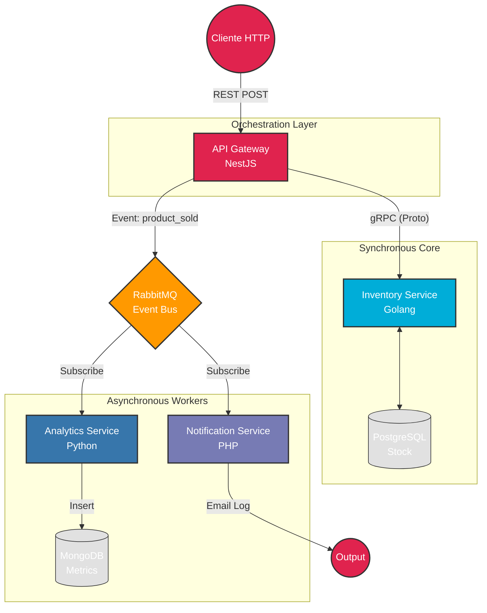

# 🌐 PolyglotMicro: Ecosistema de Microservicios Políglota


> **Una arquitectura de referencia distribuida, escalable y resiliente.**

---

## 📖 Visión General

**PolyglotMicro** demuestra cómo orquestar servicios heterogéneos en un sistema de comercio electrónico moderno. El proyecto rompe con el monolito tradicional aprovechando las fortalezas nativas de cada lenguaje:

* 🚀 **Node.js (NestJS):** I/O no bloqueante para el Gateway y manejo de tráfico.
* ⚡ **Go (Golang):** Rendimiento crítico y concurrencia para transacciones de inventario.
* 🐍 **Python (FastAPI):** Procesamiento de datos y analítica en segundo plano.
* 🐘 **PHP:** Integración robusta para sistemas legacy o servicios de notificación.

### 🧩 Patrones Implementados
* **API Gateway** (Punto único de entrada)
* **Database per Service** (Desacoplamiento de datos)
* **Event-Driven Architecture** (Comunicación asíncrona vía RabbitMQ)
* **gRPC & Protobuf** (Comunicación síncrona de alto rendimiento)

---

## 🏗 Arquitectura del Sistema

El flujo combina integridad transaccional (gRPC) con escalabilidad eventual (RabbitMQ).



## 🚀 Stack Tecnológico

| Servicio | Tecnología | Protocolo | Base de Datos | Decisión Arquitectónica |
|----------|------------|-----------|---------------|-------------------------|
| **Gateway** | NestJS | REST | N/A | Validación con DTOs y documentación Swagger. |
| **Inventory** | Go (Golang) | gRPC | PostgreSQL | Atomicidad (ACID) y velocidad binaria. |
| **Analytics** | Python | AMQP | MongoDB | Flexibilidad de esquema para métricas masivas. |
| **Notify** | PHP 8.2 | AMQP | N/A | Resiliencia con script de reconexión automática. |

---

## 📊 Dashboards y Observabilidad

El proyecto incluye interfaces gráficas para monitorear el sistema sin tocar la terminal.

| Herramienta | URL Local | Descripción | Credenciales |
|-------------|-----------|-------------|--------------|
| **Swagger UI** | [Abrir Link](http://localhost:3000/api) | Documentación interactiva API. | N/A |
| **Mongo UI** | [Abrir Link](http://localhost:8081) | Visualizador de datos NoSQL. | `admin` / `pass` |
| **RabbitMQ** | Abrir Link | Monitor de colas y eventos. | `guest` / `guest` |

---

## 🛠 Instalación y Despliegue

Todo el sistema está contenerizado con Docker.

### Prerrequisitos
* Docker Engine & Docker Compose
* Git

### Pasos

1. **Clonar el repositorio:**
```bash
git clone https://github.com/systaxiecuador/polyglot-micro.git
cd polyglot-micro
```

2. **Desplegar servicios:**
```bash
docker-compose up -d --build
```

3. **Verificar estado:**
```bash
docker ps
```

---

## 🧪 Cómo Probar (Testing)

### 1. Realizar una Compra
Envía una petición POST al Gateway (puedes usar el Swagger UI). Esto reducirá stock en Postgres y disparará eventos a las colas.

* **Endpoint:** `POST /inventory/decrease`
* **Content-Type:** `application/json`

```json
{
  "product_id": 1,
  "quantity": 2,
  "order_id": "ORD-2024-001"
}
```

### 2. Verificar Resultados
* **Stock (Síncrono):** Consulta `GET /inventory/1`. Verás que la cantidad bajó instantáneamente.
* **Analítica (Asíncrono):** Ve a Mongo Express (localhost:8081). En la BD `analytics_db` verás el registro JSON.
* **Notificación (Asíncrono):** Revisa los logs de PHP:

```bash
docker logs svc_notifications
```
> Salida esperada: `[EMAIL] Enviando correo de confirmación...`

---

## 📂 Estructura del Proyecto

```plaintext
PolyglotMicro/
├── api-gateway/           # NestJS (Controllers, Swagger, gRPC Client)
├── inventory-service/     # Go (Server gRPC, PostgreSQL Driver)
├── analytics-service/     # Python (RabbitMQ Consumer, PyMongo)
├── notification-service/  # PHP (RabbitMQ Consumer, Mail Logic)
├── protos/                # Contratos Protocol Buffers compartidos
├── docker-compose.yml     # Orquestación de contenedores
└── README.md              # Documentación del proyecto
```

---

## 👨‍💻 Autor

**Oscar Ordoñez**
*Backend Developer | Microservices Enthusiast*